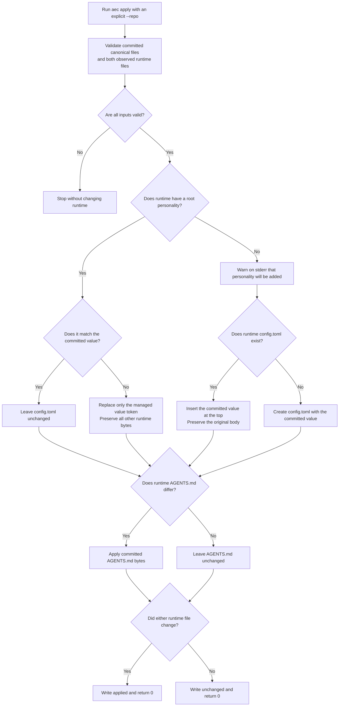
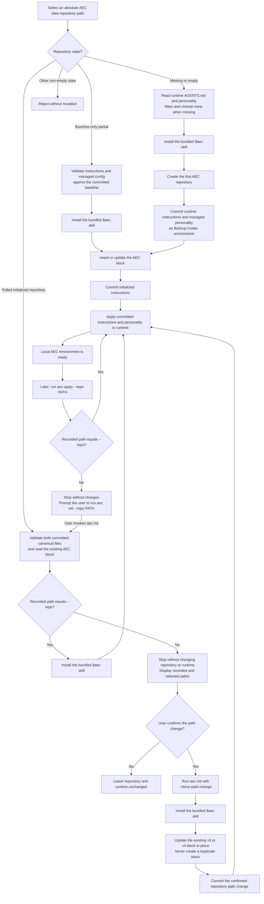

# AI Environment as Code

Version 1.2.3 hardens repository and runtime path containment and disables Git
replacement objects during backup validation and commit operations.

## Version history

| Version | Increment |
|---|---|
| 0.1 | Project initialization |
| 0.2 | `init` command |
| 0.3 | `backup` command |
| 0.4 | `init` AEC instruction injection and update |
| 0.5 | `apply` command |
| 0.6 | ChatGPT provider initialization |
| 0.7 | Install the `$aec` Codex skill during ordinary `init` |
| 0.8 | Require explicit repository-aware initialization |
| 0.9 | Commit-first initialization through `backup` and `apply` |
| 0.10 | Attach pulled repositories and explicitly rebind moved paths |
| 0.11.1 | Compare managed Codex `personality` state through `status` |
| 0.11.2 | Apply committed Codex `personality` while preserving runtime config |
| 0.11.3 | Back up runtime Codex `personality` with runtime instructions |
| 0.11.4 | Enroll Codex `personality` in the initial environment baseline |
| 0.12.0 | Report the executable version through the `version` command |
| 0.13.0 | Upgrade recognized official Codex skill guidance explicitly |
| 0.13.1 | Diagnose a running Codex process with a stale executable `PATH` |
| 1.0.0 | First stable release after private end-to-end dogfooding |
| 1.1.0 | Remove AEC runtime instructions and exact official skill files |
| 1.2.0 | Generate a contained uninstaller beside the macOS ARM64 installer |
| 1.2.1 | Apply recommended Roslyn analysis and behavior-preserving cleanup |
| 1.2.2 | Centralize test application execution and Git environment isolation |
| 1.2.3 | Harden backup path containment and Git object verification |

The project and CLI report the current release as `1.2.3` through `aec version`.

## version

```text
aec version
```

`version` reports the installed AEC executable release without reading or changing
a data repository or runtime state. It accepts no options or operands. The former
`aec --version` form is unsupported.

## skill upgrade

```text
aec skill upgrade [--codex-home ABSOLUTE_PATH]
```

Executable installation and skill-guidance upgrade are deliberately separate:


The newly installed executable supplies the latest bundled guidance. The user may
run `aec skill upgrade` directly or explicitly ask Codex to run it; the command is
never inferred merely because a newer release may exist. It updates only:

```text
<codex-home>/skills/aec/SKILL.md
<codex-home>/skills/aec/agents/openai.yaml
```

It takes no `--repo` because it neither reads nor changes an AEC data repository.
An explicit absolute `--codex-home` takes precedence over a non-empty `CODEX_HOME`;
when both are absent, the command uses `~/.codex`.
Both managed files are checked before either changes. Only exact official v0.9.0,
v0.10.0, v0.11.4, v0.12.0, v0.13.0, and v1.0.0 predecessors—or the current bundle—are
accepted. Missing, modified, unsupported, linked, or otherwise invalid managed
state fails closed. A retry safely completes a recognized old/current mixture,
unrelated files are preserved, and replaced files retain their existing Unix
permission bits.

The command writes `upgraded` when it replaces guidance or `unchanged` when both
files are already current. It does not download, build, or install the executable;
change Git, AEC data, runtime `AGENTS.md` or `config.toml`; or touch other skills.
No Codex restart or new task is required for this skill-only update. The next
request that selects `$aec` reads the updated installed `SKILL.md` guidance.

## uninstall

```text
aec uninstall [--codex-home ABSOLUTE_PATH]
```

`uninstall` removes AEC's Codex runtime integration while the executable is still
available to perform the cleanup. It accepts no `--repo` and never reads, changes,
commits, or deletes an AEC data repository.

After preflighting every target, the command:

- removes the exact supported v3 or v4 AEC block from runtime `AGENTS.md`;
- preserves every non-AEC instruction byte;
- removes only exact current or recognized official predecessor copies of
  `skills/aec/SKILL.md` and `skills/aec/agents/openai.yaml`;
- preserves unrelated skills and extra files under the AEC skill directory; and
- leaves runtime `config.toml`, including `personality`, byte-for-byte unchanged.

An unmanaged `$aec` reference outside the managed instruction block, a customized
managed skill file, malformed instructions, linked paths, or another invalid target
stops the command before its first mutation. Instructions are removed before skill
files, so a retry can finish a recognized interrupted cleanup. It writes
`uninstalled` when anything was removed and `unchanged` when no managed integration
remains.

## apply

```text
aec apply --repo ABSOLUTE_PATH [--codex-home ABSOLUTE_PATH]
```

`apply` has the opposite data-flow direction from `backup`:

```text
committed <repo>/environment/providers/codex/AGENTS.md
  -> <codex-home>/AGENTS.md
committed <repo>/environment/providers/codex/config.toml personality
  -> <codex-home>/config.toml personality
```

The repository must be the exact root of a non-bare Git working tree with a
committed `HEAD`. Detached HEAD is accepted because `apply` does not create a commit.
Both canonical paths must be committed regular Git files with no staged or unstaged
changes, and their raw working bytes must exactly match their committed blobs. This
rejects line-ending, clean/smudge, and other Git filters that could make visibly
different bytes appear clean. Unrelated repository changes are ignored and untouched.

When the committed canonical source contains a supported v3 or v4 AEC block,
`apply` checks its recorded repository path before reading runtime state. A path
mismatch displays both paths, returns an error without mutation, and directs the
caller to ordinary `aec init`. Malformed or unsupported AEC markers also fail
closed. `apply` never accepts `--force-path-change`.

The managed configuration decision is intentionally non-interactive:



An existing managed value is normalized only when its meaning differs; comments,
line endings, unrelated root settings, tables, and other bytes remain intact. A
missing value produces a warning on standard error, then the same invocation inserts
the committed value at the top or creates the missing runtime file. Invoking `apply`
is already the authorization, so there is no second confirmation prompt.

On Unix, an existing runtime config retains its permission bits and a newly created
config is restricted to the current user. A planned result over 1 MiB is rejected
before either runtime file changes.

Both runtime plans are validated before mutation. Each changed file is written
through its own flushed sibling temporary file, compare-before-replace check, and
post-write verification. Two separate files cannot form one portable atomic
transaction; interruption between them is safe to detect and resume with `status`
and another `apply`. A runtime target inside the data repository is rejected.

The command writes `applied` when either runtime file changes or `unchanged` when
neither needs a write; both return exit code 0.

There is no separate backup, receipt, Git mutation, commit, or push.

## backup

```text
aec backup --repo ABSOLUTE_PATH [--codex-home ABSOLUTE_PATH]
```

`backup` has one explicit data-flow direction:

```text
<codex-home>/AGENTS.md
  -> <repo>/environment/providers/codex/AGENTS.md
<codex-home>/config.toml personality
  -> <repo>/environment/providers/codex/config.toml personality
both canonical paths
  -> one Git commit in <repo>
```

The repository must be the exact root of a non-bare Git working tree on a symbolic
branch. Repository and runtime paths must not contain symbolic-link or reparse-point
ancestors, and the runtime must remain outside the data repository. Before changing
canonical data, the command rejects staged, unstaged, or untracked changes outside
the two fixed managed paths. Pending changes at either managed path are allowed so a
rerun can resume after an interrupted write or failed commit.

Both runtime files and any existing canonical config are read and validated before
either canonical file changes. A missing runtime `config.toml` or missing root
`personality` prints a warning on standard error and returns exit code 1 without
changing or staging repository data. Invalid, duplicate, ambiguous, or unsupported
values also stop before capture.

`AGENTS.md` is captured byte-for-byte. If canonical `config.toml` is absent, backup
creates its minimal normalized managed value. Otherwise it replaces only the value
token when its meaning differs, preserving canonical comments, spacing, line
endings, and an optional UTF-8 byte-order mark. Unrelated runtime settings are never
copied or changed.

Each changed canonical file is replaced through its own flushed sibling temporary
file, compare-before-replace check, and post-write verification. Two files cannot
form one portable atomic filesystem transaction; interruption between them leaves
only recognizable managed working changes that another `backup` can resume. The
command stages only the two fixed canonical paths and creates one commit with this
subject:

```text
Backup Codex environment
```

Git filters that would change either file's bytes while staging are rejected before
commit. Git replacement objects are disabled throughout backup inspection, commit,
and verification so validation always observes the raw repository objects.
Configured Git hooks are isolated from the backup commit so they cannot alter the
verified bytes or fixed subject; both managed blobs and the subject are checked
again after the commit. On success, the command writes
`committed <full-sha>`. When both managed values, working files, index, and current
commit already agree, it writes `unchanged`. Both outcomes return exit code 0;
validation and Git failures return exit code 1.

There is no separate backup directory or backup manifest. Git commit history is the
source of truth. `backup` does not push or write runtime state; `apply` remains the
separate repository-to-runtime command.

## init

```text
aec init --repo ABSOLUTE_PATH [--codex-home ABSOLUTE_PATH] [--force-path-change]
```

`init` creates a data repository in a missing or empty directory. It may also resume
only a recognizable baseline-only partial initialization, or attach a clean,
completed AEC repository pulled to the selected path. Other non-empty targets are
rejected. `--repo` is required and must be the absolute path of that source-of-truth
repository. The current working directory and engine repository are never inferred.

`--codex-home` selects the runtime root. When omitted, `init` uses a non-empty
`CODEX_HOME` and then `~/.codex`, matching the other commands. The Codex home must
already exist. Fresh and baseline-only initialization require its regular
`AGENTS.md`; a missing runtime fails before repository or skill mutation. Runtime
`config.toml` may be missing, but any existing file must be valid supported TOML.
If its root `personality` is absent, `init` warns that `none` will be enrolled and
waits until both initialization commits succeed before adding it to runtime. A
completed pulled repository may create either missing runtime file from committed
canonical state.

Ordinary `init` also installs these bundled skill metadata files:

```text
<codex-home>/skills/aec/SKILL.md
<codex-home>/skills/aec/agents/openai.yaml
```

Only those two files are managed. Missing files are created, identical files are
retained without rewriting, and unrelated skills or extra files are preserved. A
different existing managed file is treated as a conflict and is never overwritten;
the command fails before creating the repository or changing runtime instructions.
This permits multiple data repositories to share one exact skill installation.

The skill invokes `aec` by command name and stops if it is unavailable on Codex's
`PATH`. The developer-built macOS ARM64 Native AOT workflow is documented below,
but `init` does not search for, build, or run an engine checkout as a fallback. It
still fails closed when either managed skill file differs. After installing a newer
AEC executable, use `aec skill upgrade` to replace an exact recognized official
predecessor; modified or unknown files are never overwritten.

A resumable target must be a `main` repository containing one recognized root
baseline. Current baselines use `Backup Codex environment` and contain exactly the
runtime `AGENTS.md` bytes plus canonical managed `config.toml`; legacy baselines use
`Backup Codex AGENTS.md` and contain only the runtime instructions. The runtime
managed value must still agree semantically with a current baseline, while both a
missing value and explicit `none` agree with a committed `none`. The working
canonical files may contain only the baseline or exact expected managed result.
Baseline lookalikes, unrelated changes, links, and special entries are rejected.

A completed repository must retain the recognizable two-commit initialization
ancestry, use symbolic branch `main`, contain a real `.git` directory whose metadata
remains inside the selected root, and have a clean index and work tree. Both current
canonical files must exactly match committed `HEAD`; instructions must contain a
supported v3 or v4 AEC block and config must contain one supported managed value.
Legacy histories remain attachable after canonical config was added in a later
commit. A truly pre-config completed `HEAD` fails closed instead of inventing state.
Later commits and committed provider files are allowed.

The AEC-managed instruction block is delimited and versioned explicitly:

```markdown
<!-- AEC:BEGIN version=3 -->
## AI Environment as Code

The AEC data repository selected by `--repo` is `/absolute/path/to/data-repository`.
Treat that repository's Git commit history as the source of truth.
Preserve instructions outside this managed block.
Use `aec status` to inspect drift and `aec backup` to record approved runtime changes.
<!-- AEC:END -->
```

When no block exists, `init` inserts it at the logical top of the canonical copy,
after an optional UTF-8 byte-order mark, followed by one blank separator line and
the existing instructions. An older version is replaced in place. A current block
is retained byte-for-byte when it already contains the expected managed content and
`--repo` path; otherwise that block is reconciled in place. Duplicate, malformed,
or newer-version markers, invalid UTF-8, NUL bytes, and merged content over 1 MiB
are rejected.

For a fresh target, an explicit `init` invocation authorizes this fixed lifecycle:

```text
runtime AGENTS.md + runtime personality (missing means none)
  -> canonical AGENTS.md + canonical config.toml
  -> commit: Backup Codex environment
  -> reconcile only the canonical AEC instruction block
  -> commit: Initialize AEC instructions
  -> apply both committed managed files to runtime
```

The root commit preserves exact runtime instruction bytes and records only the
managed personality, not machine-owned runtime config. The second commit changes
only instructions and is always created, including as an empty commit when the
baseline already has the exact current block. A recognized legacy baseline resumes
after its existing AGENTS-only root and introduces canonical config in that second
commit without rewriting history. Runtime remains untouched until both commits
succeed. Apply then preserves unrelated runtime TOML while adding or replacing only
`personality`; it stops if either managed runtime value changed since preflight. Git
hooks are isolated, line-ending conversion is disabled locally, exact staged bytes
are verified, and the command does not push. No separate `backup` or `apply`
invocation is needed.

A failure before the second commit leaves the runtime untouched and a recognizable
baseline may resume. A failure after the second commit leaves a complete repository.
Rerunning ordinary `init` at the recorded path uses the attachment flow: it installs
the bundled skill and applies the committed managed environment without another
backup or commit.

### v0.10 pulled-repository initialization

The following flow lets `init` attach a pulled, already initialized AEC repository
to another local machine without silently changing its recorded
absolute path:



Path mismatch detection is read-only. The command is deliberately non-interactive:
it displays the recorded and selected paths and stops. The caller must obtain user
confirmation before rerunning with `--force-path-change`. A confirmed rebind
preserves every non-AEC byte and the existing v3 provider-neutral or v4
ChatGPT-aware block type, commits only the canonical source as
`Rebind AEC repository path`, and does not push. A machine using the previous path
may subsequently require its own confirmed rebind.

Before a routine `apply` writes runtime instructions, it must compare the repository
path recorded in the AEC block with the selected `--repo`. A mismatch returns an
error without changing Git, canonical instructions, installed skills, or runtime,
and prompts the user to run `aec init --repo PATH`. The `--force-path-change` switch
is valid only with ordinary `init`; fresh, partial-baseline, and provider modes
reject it. `apply` remains Git-read-only and cannot confirm or perform a path change.

### ChatGPT provider initialization

```text
aec init --repo ABSOLUTE_PATH --provider=chatgpt
```

Provider initialization extends an existing AEC data repository, so the directory
may be non-empty. It must be the exact root of a real, non-bare Git work tree and
must already contain `environment/providers/codex/AGENTS.md`. A committed `HEAD`
and a clean work tree are not required.

The command creates only missing empty files:

```text
environment/providers/chatgpt/custom-instructions.md
environment/providers/chatgpt/project-baseline.md
environment/providers/chatgpt/gpt-baseline.md
```

Existing manual backups are retained byte-for-byte. The command also upgrades an
earlier managed block—including the released provider-aware version 2 or the
provider-neutral version 3—to this provider-aware version 4:

```markdown
<!-- AEC:BEGIN version=4 -->
## AI Environment as Code

The AEC data repository selected by `--repo` is `/absolute/path/to/data-repository`.
Treat that repository's Git commit history as the source of truth.
Preserve instructions outside this managed block.
Use `aec status` to inspect drift and `aec backup` to record approved runtime changes.

Manual ChatGPT instruction backups live under `/absolute/path/to/data-repository/environment/providers/chatgpt/`.
If you detect uncommitted changes there, say that a manual backup is pending and ask before running AEC validation, exact-path staging, commit, and push.
Never automatically capture from or deploy to ChatGPT, and never claim account-side runtime verification.
<!-- AEC:END -->
```

Instructions outside that block are preserved. Provider mode never reads or writes
`CODEX_HOME`, even when the environment variable is set, and combining it with
`--codex-home` is an error. Ordinary `init` remains provider-neutral and does not
create ChatGPT paths or add ChatGPT guidance. Provider mode also does not install,
repair, or inspect the Codex skill.

If an existing supported block records another repository path, provider mode stops
before creating files or changing canonical instructions and directs the caller to
the ordinary confirmed-init flow. `--force-path-change` is not valid in provider
mode.

The first change writes `initialized`; an idempotent rerun writes `unchanged`.
Both return exit code 0. `unchanged` describes only the initialized file state—it
does not mean the files are committed. Provider initialization performs no
staging, commit, push, or ChatGPT account operation.

## status

The `status` command is read-only:

```text
aec status --repo ABSOLUTE_PATH [--codex-home ABSOLUTE_PATH]
```

`--repo` identifies these canonical sources:

```text
<repo>/environment/providers/codex/AGENTS.md
<repo>/environment/providers/codex/config.toml
```

`--codex-home` identifies the observed runtime root. When omitted, the tool uses a
non-empty `CODEX_HOME` environment variable and then falls back to `~/.codex`. It
observes `<codex-home>/AGENTS.md` and `<codex-home>/config.toml`. Explicit paths and
`CODEX_HOME` must be absolute; neither the executable nor current working directory
is treated as the data repository. Repository and runtime paths must not contain
symbolic-link or reparse-point ancestors, and the runtime must remain outside the
data repository.

The command compares exact `AGENTS.md` bytes. For `config.toml`, it compares only
the root `personality` value and ignores formatting, comments, unrelated root
settings, and table-scoped settings. The canonical config may contain only that
managed setting. Supported values are `none`, `friendly`, and `pragmatic`. Managed
declarations may use bare or quoted root keys and single-line basic or literal TOML
strings; multiline managed strings fail closed.

After validating both artifacts without changing any file, `status` writes:

```text
codex/AGENTS.md   in_sync
codex/config.toml in_sync
```

Each line uses one of these states:

| Status | Meaning | Exit code |
|---|---|---:|
| `in_sync` | Canonical and runtime content agree | 0 when both agree |
| `different` | Managed canonical and runtime content differ | 2 |
| `missing` | The runtime file or managed runtime value is absent | 2 |

Invalid arguments, missing roots or canonical data, symbolic links, directories,
files over 1 MiB, invalid UTF-8, duplicate or ambiguous managed declarations,
unsupported personality values, and file-system failures write a diagnostic to
standard error and return exit code 1 without partial status output.

## Codex configuration ownership

AEC manages selected personal Codex settings rather than copying the whole runtime
`config.toml`. The canonical source is:

```text
<repo>/environment/providers/codex/config.toml
```

The canonical file contains only AEC-managed root settings. Runtime content outside
those settings remains machine-owned and must be preserved. The first managed key
is `personality`:

```toml
personality = "none"
```

`none` is the default when the runtime key is missing. The
[OpenAI Codex configuration reference](https://learn.chatgpt.com/docs/config-file/config-reference)
documents `none`, `friendly`, and `pragmatic` as supported personality values; AEC
accepts all three. `model` and `model_reasoning_effort` remain outside AEC ownership
unless a later explicit design decision enrolls them.

The intended data flow remains directional:

```text
status: compare canonical and runtime managed values without mutation
backup: existing runtime managed values -> canonical values -> Git commit
apply:  committed canonical values -> runtime managed values
```

`apply` warns before inserting a missing runtime key and otherwise replaces only the
managed value. `backup` remains strictly runtime-to-repository: when the key is
absent, it warns and stops without changing either side. `init` captures an existing
supported runtime value in the root environment commit. When it is absent, `init`
warns, records `none` in that commit, and adds `personality = "none"` to runtime only
after both initialization commits succeed.

### Why `MEMORY.md` is not managed

AEC intentionally does not capture Codex's `MEMORY.md` or its memory directory.
Codex creates and maintains memory as derived runtime state from prior work; it is
not stable, user-authored environment configuration. Memory may also contain
summarized project history or other sensitive context, so committing it would
increase its retention and distribution.

The memory format and lifecycle belong to Codex and may change between application
versions or machines. Restoring an old snapshot could therefore reintroduce stale
context or conflict with Codex's current memory. AEC instead versions user-owned
inputs: `AGENTS.md` and explicitly selected stable `config.toml` settings. Durable
guidance should be recorded in those canonical instructions or in project
documentation, not copied from Codex's generated memory.

## Build, test, and run

The production project uses only the .NET 10 Base Class Library. The test project
uses xUnit and has no coverage dependency.

### Test strategy and expected duration


The complete suite currently contains unit, Git integration, and filesystem-safety
tests in one xUnit project. A full Debug run of 315 tests takes about five minutes on
an ARM64 Mac even when the project is already built. VSTest may print nothing during
most of that time; wait for its final summary rather than treating a quiet console
as a hang.

| Cost | What happens |
|---|---|
| Process-state isolation | Command suites run sequentially because they safely change environment variables and the current directory. |
| Real Git integration | Tests repeatedly create repositories and start `git` for inspection, hashing, staging, commits, and verification. |
| Filesystem safety | Each case creates isolated paths and exercises links, FIFOs, permissions, atomic replacement, and durable flushes. |

During development, run the smallest relevant scope. These filters work today:

```bash
# Fast instruction-block unit tests
dotnet test tests/Aec.Tests/Aec.Tests.csproj \
  --filter "FullyQualifiedName~AecInstructionBlockTests"

# One affected command suite; replace BackupTests as needed
dotnet test tests/Aec.Tests/Aec.Tests.csproj \
  --filter "FullyQualifiedName~BackupTests"
```

Run the complete regression suite before pushing and again in Release configuration
before publishing a release. The hang guard terminates and identifies an individual
test that stops making progress for 30 seconds:

```bash
# Before push
dotnet test tests/Aec.Tests/Aec.Tests.csproj \
  --blame-hang \
  --blame-hang-timeout 30s \
  --blame-hang-dump-type none

# Before release
dotnet test tests/Aec.Tests/Aec.Tests.csproj \
  --configuration Release \
  --blame-hang \
  --blame-hang-timeout 30s \
  --blame-hang-dump-type none
```

The roadmap is to classify stable test scopes explicitly. Until that work is
complete, class-name filters are the supported focused workflow; the full suite
remains the regression gate rather than the default command after every edit.

```bash
dotnet build src/Aec/Aec.csproj
dotnet run --project src/Aec/Aec.csproj -- version
dotnet run --project src/Aec/Aec.csproj -- help
dotnet run --project src/Aec/Aec.csproj -- \
  skill upgrade \
  --codex-home /absolute/path/to/codex-home
dotnet run --project src/Aec/Aec.csproj -- \
  uninstall \
  --codex-home /absolute/path/to/codex-home
dotnet run --project src/Aec/Aec.csproj -- \
  init \
  --repo /absolute/path/to/new-data-repository \
  --codex-home /absolute/path/to/codex-home
dotnet run --project src/Aec/Aec.csproj -- \
  init \
  --repo /absolute/path/to/data-repository \
  --provider=chatgpt
dotnet run --project src/Aec/Aec.csproj -- \
  status \
  --repo /absolute/path/to/data-repository \
  --codex-home /absolute/path/to/codex-home
dotnet run --project src/Aec/Aec.csproj -- \
  backup \
  --repo /absolute/path/to/data-repository \
  --codex-home /absolute/path/to/codex-home
dotnet run --project src/Aec/Aec.csproj -- \
  apply \
  --repo /absolute/path/to/data-repository \
  --codex-home /absolute/path/to/codex-home
```

### Native AOT on Apple-silicon macOS

The initial executable workflow supports only ARM64 macOS. Git is required at
runtime because AEC repositories use Git history as their source of truth. Building
requires the .NET 10 SDK and Xcode Command Line Tools:

```bash
./scripts/build-osx-arm64.sh
```

These examples assume the repository root as the working directory. Once invoked
through a valid relative or absolute path, each script resolves the repository from
its own location rather than the caller's working directory. The build publishes
the self-contained executable to:

```text
artifacts/aec-osx-arm64/aec
```

After a successful build, install it for the current user:

```bash
./scripts/install-osx-arm64.sh
```

The default target is `$HOME/.local/bin/aec`. An explicit absolute directory can
be selected instead:

```bash
./scripts/install-osx-arm64.sh --install-dir /absolute/path/to/bin
```

When the selected directory differs from `$HOME/.local/bin`, installation continues
but prints a warning because the `$aec` skill invokes `aec` through Codex's `PATH`.
Make the directory available to Codex, restart Codex, and verify `aec help`.

The installer never uses `sudo` or changes shell profiles or `PATH`. If
`$HOME/.local/bin` is not already on `PATH`, configure the shell yourself, for
example:

```bash
export PATH="$HOME/.local/bin:$PATH"
```

### Codex cannot find a newly installed `aec`

Codex inherits its `PATH` when the app starts. Therefore, if `aec` was installed
or its directory was added to `PATH` while Codex was already running, Codex can
report that `aec` is unavailable even though a new terminal can execute it. Fully
quit and restart Codex, then run `aec help` again. Starting a new task is not
enough because it stays in the existing app process.

This restart is only for executable discovery. After `aec skill upgrade` replaces
`SKILL.md`, no restart or new task is required.

After building, validate both the default and custom installation behavior with:

```bash
./tests/install-osx-arm64.sh
```

The installed Native AOT executable does not require .NET. To upgrade, update the
source checkout, rerun the build and installer scripts, then run
`aec skill upgrade`. Reinstalling identical executable bytes reports
`unchanged`; upgrading already-current skill guidance also reports `unchanged`.

The macOS ARM64 installer generates `scripts/uninstall-aec.sh` in the same folder
as `scripts/install-osx-arm64.sh`. Run it by its explicit path, so it can safely
remove itself after the runtime cleanup succeeds:

```bash
./scripts/uninstall-aec.sh
```

For a non-default Codex home, pass its absolute path:

```bash
./scripts/uninstall-aec.sh --codex-home /absolute/path/to/.codex
```

The script calls the exact binary selected by the latest installation; it does not
depend on `PATH`. It first runs `aec uninstall`, then removes that binary and the
generated script only on success. It preserves every AEC data repository and all
runtime `config.toml` bytes. Reinstalling at a new directory updates this generated
script to that latest binary; an earlier binary remains untouched and can be removed
manually if no longer wanted.

## Current boundaries

The tool does not implement `diff`, `verify`, `restore`, rendering, manifests,
automatic ChatGPT capture or deployment, prebuilt binary distribution, or pushing.

Source writes and Git commits operate only on the data repository explicitly
selected with `--repo`; they never infer or modify the engine repository.

## License

This project is available under the [MIT License](LICENSE).

If you find it useful, please consider citing the original work by
[@ferrywlto](https://github.com/ferrywlto) or
[buying me a coffee](https://www.paypal.com/paypalme/ferrywlto). ☕️
