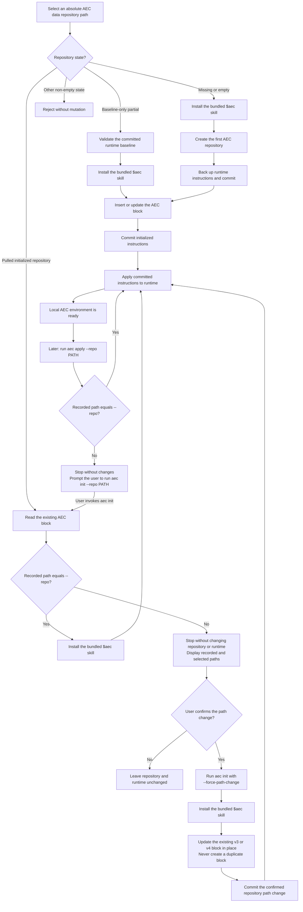

# AI Environment as Code

Version 0.11.1 adds read-only status reporting for the first managed Codex
`config.toml` value while retaining the existing minimal .NET workflows for Codex
instructions and manual ChatGPT backups.

## Version history

| Version | Increment |
|---|---|
| 0.1 | Project initialization |
| 0.2 | `init` command |
| 0.3 | `backup` command |
| 0.4 | `init` AEC instruction injection and update |
| 0.5 | `apply` command |
| 0.6 | ChatGPT provider initialization |
| 0.7 | Install the `$aec` Codex skill during ordinary `init` |
| 0.8 | Require explicit repository-aware initialization |
| 0.9 | Commit-first initialization through `backup` and `apply` |
| 0.10 | Attach pulled repositories and explicitly rebind moved paths |
| 0.11.1 | Compare managed Codex `personality` state through `status` |

The project and CLI report the current release as `0.11.1`.

## apply

```text
aec apply --repo ABSOLUTE_PATH [--codex-home ABSOLUTE_PATH]
```

`apply` has the opposite data-flow direction from `backup`:

```text
committed <repo>/environment/providers/codex/AGENTS.md
  -> <codex-home>/AGENTS.md
```

The repository must be the exact root of a non-bare Git working tree with a
committed `HEAD`. Detached HEAD is accepted because `apply` does not create a commit.
The canonical path must be a committed regular Git file with no staged or unstaged
changes, and its raw working bytes must exactly match the committed blob. This
rejects line-ending, clean/smudge, and other Git filters that could make visibly
different bytes appear clean. Unrelated repository changes are ignored and untouched.

When the committed canonical source contains a supported v3 or v4 AEC block,
`apply` checks its recorded repository path before reading runtime state. A path
mismatch displays both paths, returns an error without mutation, and directs the
caller to ordinary `aec init`. Malformed or unsupported AEC markers also fail
closed. `apply` never accepts `--force-path-change`.

When runtime bytes differ or the runtime file is absent, `apply` writes a flushed
temporary file beside the target, confirms the observed runtime has not changed,
moves the file into place, and verifies the resulting bytes. A runtime target inside
the data repository is rejected. The command writes `applied` after a successful
write or `unchanged` when no write is needed; both return exit code 0.

Invocation itself authorizes replacing observed runtime drift. There is no second
confirmation flag, separate backup, receipt, Git mutation, commit, or push.

## backup

```text
aec backup --repo ABSOLUTE_PATH [--codex-home ABSOLUTE_PATH]
```

`backup` has one explicit data-flow direction:

```text
<codex-home>/AGENTS.md
  -> <repo>/environment/providers/codex/AGENTS.md
  -> Git commit in <repo>
```

The repository must be the exact root of a non-bare Git working tree on a symbolic
branch. Before changing the canonical source, the command rejects staged, unstaged,
or untracked changes anywhere else in the repository. A pending change to the
canonical source itself is allowed: the runtime file replaces it, or an already
equal staged copy is committed. This lets a rerun resume after a prior commit
failure.

When the runtime bytes differ, the canonical source is replaced through a flushed
temporary file in the same directory and read back for verification. The command
then stages only the fixed canonical path and creates a commit with this subject:

```text
Backup Codex AGENTS.md
```

Git filters that would change the bytes while staging are rejected before commit.
Configured Git hooks are isolated from the backup commit so they cannot alter the
verified bytes or fixed subject; both are checked again after the commit.
On success, the command writes `committed <full-sha>`. When the runtime, working
file, index, and current commit already agree, it writes `unchanged`. Both outcomes
return exit code 0; validation and Git failures return exit code 1.

There is no separate backup directory or backup manifest. Git commit history is the
source of truth. This increment does not push, write the runtime target, or implement
the inverse `restore` direction.

## init

```text
aec init --repo ABSOLUTE_PATH [--codex-home ABSOLUTE_PATH] [--force-path-change]
```

`init` creates a data repository in a missing or empty directory. It may also resume
only a recognizable baseline-only partial initialization, or attach a clean,
completed AEC repository pulled to the selected path. Other non-empty targets are
rejected. `--repo` is required and must be the absolute path of that source-of-truth
repository. The current working directory and engine repository are never inferred.

`--codex-home` selects the runtime root. When omitted, `init` uses a non-empty
`CODEX_HOME` and then `~/.codex`, matching `status` and `backup`. The Codex home must
already exist. Fresh and baseline-only initialization require its regular
`AGENTS.md`; a missing runtime then fails before repository or skill mutation. A
completed pulled repository may instead create the missing runtime from its
committed canonical source.

Ordinary `init` also installs these bundled skill metadata files:

```text
<codex-home>/skills/aec/SKILL.md
<codex-home>/skills/aec/agents/openai.yaml
```

Only those two files are managed. Missing files are created, identical files are
retained without rewriting, and unrelated skills or extra files are preserved. A
different existing managed file is treated as a conflict and is never overwritten;
the command fails before creating the repository or changing runtime instructions.
This permits multiple data repositories to share one exact skill installation.

The skill invokes an installed `aec` executable directly. Version 0.10 provides the
developer-built macOS ARM64 Native AOT workflow documented below, but `init` does
not search for, build, or run an engine checkout as a fallback. Skill upgrades
remain a separate future decision.

A resumable target must be a `main` repository containing one root commit named
`Backup Codex AGENTS.md`, whose only file and exact bytes match the current runtime
canonical path. The working canonical source may contain only that baseline or the
exact expected managed result, with no changes outside that path. Completed
repository handling uses the separate attachment rules below; baseline lookalikes,
unrelated changes, symbolic links, and special filesystem entries are rejected.

A completed repository must retain the recognizable two-commit initialization
ancestry, use symbolic branch `main`, contain a real `.git` directory whose metadata
remains inside the selected root, and have a clean index and work tree. Its working
canonical source must exactly match committed `HEAD` and contain an exact supported
v3 or v4 AEC block. Later commits and committed provider files are allowed.

The AEC-managed instruction block is delimited and versioned explicitly:

```markdown
<!-- AEC:BEGIN version=3 -->
## AI Environment as Code

The AEC data repository selected by `--repo` is `/absolute/path/to/data-repository`.
Treat that repository's Git commit history as the source of truth.
Preserve instructions outside this managed block.
Use `aec status` to inspect drift and `aec backup` to record approved runtime changes.
<!-- AEC:END -->
```

When no block exists, `init` inserts it at the logical top of the canonical copy,
after an optional UTF-8 byte-order mark, followed by one blank separator line and
the existing instructions. An older version is replaced in place. A current block
is retained byte-for-byte when it already contains the expected managed content and
`--repo` path; otherwise that block is reconciled in place. Duplicate, malformed,
or newer-version markers, invalid UTF-8, NUL bytes, and merged content over 1 MiB
are rejected.

For a fresh or baseline-only target, an explicit `init` invocation authorizes this
fixed lifecycle:

```text
runtime AGENTS.md
  -> environment/providers/codex/AGENTS.md
  -> commit: Backup Codex AGENTS.md
  -> canonical source with reconciled AEC block
  -> commit: Initialize AEC instructions
  -> runtime AGENTS.md through apply
```

The first commit preserves the runtime bytes without AEC mutation. The second commit
is always created, including as an empty commit when the baseline already has the
exact current block. Only then does `init` run the apply flow. It performs no write
when runtime already equals the committed source; otherwise it stops if runtime
changed after backup. Git hooks are isolated, line-ending conversion is disabled
locally, exact staged bytes are verified, and the command does not push. No separate
`backup` or `apply` invocation is needed.

A failure before the second commit leaves the runtime untouched and a recognizable
baseline may resume. A failure after the second commit leaves a complete repository.
Rerunning ordinary `init` at the recorded path uses the attachment flow: it installs
the bundled skill and applies committed instructions without another backup or
commit.

### v0.10 pulled-repository initialization

The following flow lets `init` attach a pulled, already initialized AEC repository
to another local machine without silently changing its recorded
absolute path:



Path mismatch detection is read-only. The command is deliberately non-interactive:
it displays the recorded and selected paths and stops. The caller must obtain user
confirmation before rerunning with `--force-path-change`. A confirmed rebind
preserves every non-AEC byte and the existing v3 provider-neutral or v4
ChatGPT-aware block type, commits only the canonical source as
`Rebind AEC repository path`, and does not push. A machine using the previous path
may subsequently require its own confirmed rebind.

Before a routine `apply` writes runtime instructions, it must compare the repository
path recorded in the AEC block with the selected `--repo`. A mismatch returns an
error without changing Git, canonical instructions, installed skills, or runtime,
and prompts the user to run `aec init --repo PATH`. The `--force-path-change` switch
is valid only with ordinary `init`; fresh, partial-baseline, and provider modes
reject it. `apply` remains Git-read-only and cannot confirm or perform a path change.

### ChatGPT provider initialization

```text
aec init --repo ABSOLUTE_PATH --provider=chatgpt
```

Provider initialization extends an existing AEC data repository, so the directory
may be non-empty. It must be the exact root of a real, non-bare Git work tree and
must already contain `environment/providers/codex/AGENTS.md`. A committed `HEAD`
and a clean work tree are not required.

The command creates only missing empty files:

```text
environment/providers/chatgpt/custom-instructions.md
environment/providers/chatgpt/project-baseline.md
environment/providers/chatgpt/gpt-baseline.md
```

Existing manual backups are retained byte-for-byte. The command also upgrades an
earlier managed block—including the released provider-aware version 2 or the
provider-neutral version 3—to this provider-aware version 4:

```markdown
<!-- AEC:BEGIN version=4 -->
## AI Environment as Code

The AEC data repository selected by `--repo` is `/absolute/path/to/data-repository`.
Treat that repository's Git commit history as the source of truth.
Preserve instructions outside this managed block.
Use `aec status` to inspect drift and `aec backup` to record approved runtime changes.

Manual ChatGPT instruction backups live under `/absolute/path/to/data-repository/environment/providers/chatgpt/`.
If you detect uncommitted changes there, say that a manual backup is pending and ask before running AEC validation, exact-path staging, commit, and push.
Never automatically capture from or deploy to ChatGPT, and never claim account-side runtime verification.
<!-- AEC:END -->
```

Instructions outside that block are preserved. Provider mode never reads or writes
`CODEX_HOME`, even when the environment variable is set, and combining it with
`--codex-home` is an error. Ordinary `init` remains provider-neutral and does not
create ChatGPT paths or add ChatGPT guidance. Provider mode also does not install,
repair, or inspect the Codex skill.

If an existing supported block records another repository path, provider mode stops
before creating files or changing canonical instructions and directs the caller to
the ordinary confirmed-init flow. `--force-path-change` is not valid in provider
mode.

The first change writes `initialized`; an idempotent rerun writes `unchanged`.
Both return exit code 0. `unchanged` describes only the initialized file state—it
does not mean the files are committed. Provider initialization performs no
staging, commit, push, or ChatGPT account operation.

## status

The `status` command is read-only:

```text
aec status --repo ABSOLUTE_PATH [--codex-home ABSOLUTE_PATH]
```

`--repo` identifies these canonical sources:

```text
<repo>/environment/providers/codex/AGENTS.md
<repo>/environment/providers/codex/config.toml
```

`--codex-home` identifies the observed runtime root. When omitted, the tool uses a
non-empty `CODEX_HOME` environment variable and then falls back to `~/.codex`. It
observes `<codex-home>/AGENTS.md` and `<codex-home>/config.toml`. Explicit paths and
`CODEX_HOME` must be absolute; neither the executable nor current working directory
is treated as the data repository.

The command compares exact `AGENTS.md` bytes. For `config.toml`, it compares only
the root `personality` value and ignores formatting, comments, unrelated root
settings, and table-scoped settings. The canonical config may contain only that
managed setting. Supported values are `none`, `friendly`, and `pragmatic`. Managed
declarations may use bare or quoted root keys and single-line basic or literal TOML
strings; multiline managed strings fail closed.

After validating both artifacts without changing any file, `status` writes:

```text
codex/AGENTS.md   in_sync
codex/config.toml in_sync
```

Each line uses one of these states:

| Status | Meaning | Exit code |
|---|---|---:|
| `in_sync` | Canonical and runtime content agree | 0 when both agree |
| `different` | Managed canonical and runtime content differ | 2 |
| `missing` | The runtime file or managed runtime value is absent | 2 |

Invalid arguments, missing roots or canonical data, symbolic links, directories,
files over 1 MiB, invalid UTF-8, duplicate or ambiguous managed declarations,
unsupported personality values, and file-system failures write a diagnostic to
standard error and return exit code 1 without partial status output.

## Planned Codex configuration ownership

AEC manages selected personal Codex settings rather than copying the whole runtime
`config.toml`. The canonical source is:

```text
<repo>/environment/providers/codex/config.toml
```

The canonical file contains only AEC-managed root settings. Runtime content outside
those settings remains machine-owned and must be preserved. The first managed key
is `personality`:

```toml
personality = "none"
```

`none` is the default when the runtime key is missing. The
[OpenAI Codex configuration reference](https://learn.chatgpt.com/docs/config-file/config-reference)
documents `none`, `friendly`, and `pragmatic` as supported personality values; AEC
accepts all three. `model` and `model_reasoning_effort` remain outside AEC ownership
unless a later explicit design decision enrolls them.

The intended data flow remains directional:

```text
status: compare canonical and runtime managed values without mutation
backup: existing runtime managed values -> canonical values -> Git commit
apply:  committed canonical values -> runtime managed values
```

`init` captures an existing supported runtime value. When the key is absent, `init`
warns before adding `personality = "none"` and creating the canonical config.
`apply` likewise warns before inserting a missing runtime key. `backup` remains
strictly runtime-to-repository: when the key is absent, it warns and stops without
changing either side. Configuration `apply`, `backup`, and initialization remain
later v0.11 checkpoints.

## Build, test, and run

The production project uses only the .NET 10 Base Class Library. The test project
uses xUnit and has no coverage dependency.

```bash
dotnet build src/Aec/Aec.csproj
dotnet test tests/Aec.Tests/Aec.Tests.csproj
dotnet run --project src/Aec/Aec.csproj -- --version
dotnet run --project src/Aec/Aec.csproj -- help
dotnet run --project src/Aec/Aec.csproj -- \
  init \
  --repo /absolute/path/to/new-data-repository \
  --codex-home /absolute/path/to/codex-home
dotnet run --project src/Aec/Aec.csproj -- \
  init \
  --repo /absolute/path/to/data-repository \
  --provider=chatgpt
dotnet run --project src/Aec/Aec.csproj -- \
  status \
  --repo /absolute/path/to/data-repository \
  --codex-home /absolute/path/to/codex-home
dotnet run --project src/Aec/Aec.csproj -- \
  backup \
  --repo /absolute/path/to/data-repository \
  --codex-home /absolute/path/to/codex-home
dotnet run --project src/Aec/Aec.csproj -- \
  apply \
  --repo /absolute/path/to/data-repository \
  --codex-home /absolute/path/to/codex-home
```

### Native AOT on Apple-silicon macOS

The initial executable workflow supports only ARM64 macOS. Git is required at
runtime because AEC repositories use Git history as their source of truth. Building
requires the .NET 10 SDK and Xcode Command Line Tools:

```bash
./scripts/build-osx-arm64.sh
```

These examples assume the repository root as the working directory. Once invoked
through a valid relative or absolute path, each script resolves the repository from
its own location rather than the caller's working directory. The build publishes
the self-contained executable to:

```text
artifacts/aec-osx-arm64/aec
```

After a successful build, install it for the current user:

```bash
./scripts/install-osx-arm64.sh
```

The default target is `$HOME/.local/bin/aec`. An explicit absolute directory can
be selected instead:

```bash
./scripts/install-osx-arm64.sh --install-dir /absolute/path/to/bin
```

The installer never uses `sudo` or changes shell profiles or `PATH`. If
`$HOME/.local/bin` is not already on `PATH`, configure the shell yourself, for
example:

```bash
export PATH="$HOME/.local/bin:$PATH"
```

The installed Native AOT executable does not require .NET. To upgrade it after
updating the source checkout, rerun the build and installer scripts. Reinstalling
identical bytes reports `unchanged` without rewriting the executable.

To uninstall the default executable:

```bash
rm "$HOME/.local/bin/aec"
```

This removes only the executable. It preserves AEC data repositories, runtime
instructions, and the installed `$aec` skill. Safe upgrades of an existing `$aec`
skill remain deferred to the next increment. For a custom installation, remove
`aec` from the directory passed to `--install-dir` instead.

## Current boundaries

The tool does not implement `diff`, `verify`, `restore`, rendering, manifests,
automatic ChatGPT capture or deployment, prebuilt binary distribution, skill
upgrades, or pushing.

Source writes and Git commits operate only on the data repository explicitly
selected with `--repo`; they never infer or modify the engine repository.

## License

This project is available under the [MIT License](LICENSE).

If you find it useful, please consider citing the original work by
[@ferrywlto](https://github.com/ferrywlto) or
[buying me a coffee](https://www.paypal.com/paypalme/ferrywlto). ☕️
