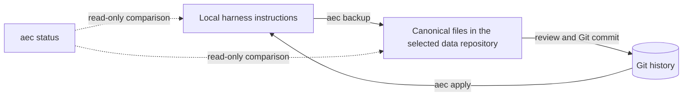
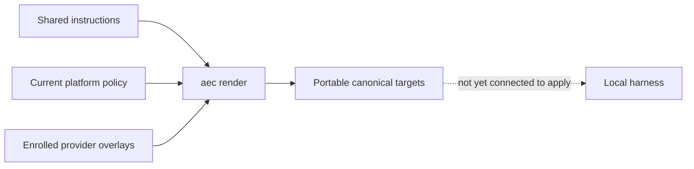
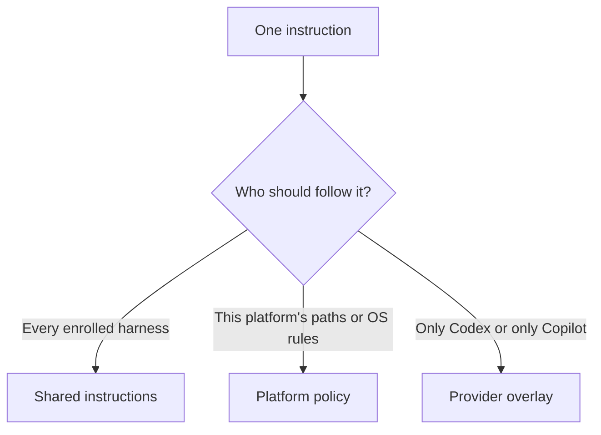

# AI Environment as Code

Version your AI environment, automatically.

AEC is a local .NET CLI that keeps selected AI-harness instructions in an
explicitly chosen Git data repository. Git history is the source of truth;
AEC never pushes for you.

## How it works today


```mermaid
flowchart LR
    Runtime[Local harness instructions] -->|aec backup| Canonical[Canonical files in the selected data repository]
    Canonical -->|review and Git commit| History[(Git history)]
    History -->|aec apply| Runtime
    Check["aec status"] -.->|read-only comparison| Runtime
    Check -.->|read-only comparison| Canonical
```

`backup` captures runtime changes and creates its approved commit. `apply`
deploys committed repository content to runtime. `status` only inspects drift.
The commands have separate directions; there is no automatic `sync`.

The 2.0.0-alpha.3 development branch adds **repository-only** enrollment and
rendering:


```mermaid
flowchart LR
    Shared[Shared instructions] --> Render["aec render"]
    Platform[Current platform policy] --> Render
    Provider[Enrolled provider overlays] --> Render
    Render --> Targets[Portable canonical targets]
    Targets -.->|not yet connected to apply| Runtime[Local harness]
```

`render` changes neither runtime nor Git history. The new
`init --enroll-shared` creates one selected target from reviewed, committed
sources without changing runtime or committing. Ordinary `init`, `status`,
`backup`, and `apply` still use their 1.x provider-specific canonical files;
runtime integration remains a later increment.

## Where should an instruction go?


```mermaid
flowchart TD
    Rule[One instruction] --> Scope{Who should follow it?}
    Scope -->|Every enrolled harness| Shared[Shared instructions]
    Scope -->|This platform's paths or OS rules| Platform[Platform policy]
    Scope -->|Only Codex or only Copilot| Provider[Provider overlay]
```

For example, “ask before committing” is shared; approved local folder paths
belong to platform policy; a Codex model choice belongs to its overlay. AEC
does not guess this split from an existing instruction file. Review and commit
all three authored sources before explicitly enrolling a target:

```text
environment/shared/instructions.md
environment/platforms/<current-platform>/policy.md
environment/providers/<selected-provider>/overlay.md
```

Then run `aec init --repo ABSOLUTE_PATH --enroll-shared` for Codex, or add
`--provider=copilot` for Copilot. Review and separately commit the new target.
This opt-in follows ordinary initialization; it does not deploy the target.

## Start on Apple-silicon macOS

You need Git, the .NET 10 SDK, and Xcode Command Line Tools to build. From this
repository, build and install the self-contained executable for your user:

```sh
./scripts/build-osx-arm64.sh
./scripts/install-osx-arm64.sh
aec version
```

The default executable location is `$HOME/.local/bin/aec`; it must be on the
`PATH` inherited by the local harness. The installer does not use `sudo` or
change your shell profile. Then select an absolute path for an empty data
repository and initialize Codex:

```sh
aec init --repo /absolute/path/to/aec-data
aec status --repo /absolute/path/to/aec-data
```

Review the changes and history before pushing your data repository to a remote.
For pulled repositories, path changes, other providers, custom install paths,
and uninstallation, use the [detailed reference](docs/reference.md).

## What has been verified

| Local harness | macOS ARM64 | Windows x64 | Linux ARM64 |
|---|---|---|---|
| Codex | ✓ Real-harness verified | ⚠ Not real-harness verified | ⚠ Not real-harness verified |
| GitHub Copilot | ⚠ Alpha; not real-harness verified | ⚠ Alpha; not real-harness verified | ⚠ Alpha; not real-harness verified |
| Claude and Gemini | ⚠ Not implemented | ⚠ Not implemented | ⚠ Not implemented |

The tests provide narrower evidence than this harness matrix:

| Test layer | Where it runs | What it proves |
|---|---|---|
| xUnit | Local macOS ARM64 today; configured for each OS workflow's next manual run | Command logic against disposable files and real temporary Git repositories on the host OS; not cross-platform emulation |
| Native AOT smoke | Manually dispatched macOS, Windows, and Linux GitHub Actions OS runners | Built executable and isolated install/lifecycle flows on those operating systems; no container is declared |
| Real harness | A machine with the actual harness installed | So far, only local Codex on macOS has been verified |

The three manually dispatched workflows now include focused composition,
section, and `render` xUnit tests. This change has passed locally on macOS;
the updated workflows have **not yet been run remotely**, and their Native AOT
steps do not directly invoke `aec render`.

## Read more

- [Shared-instruction design](docs/shared-instructions-design.md): ownership,
  enrollment, rendering, and safe directional flows.
- [Detailed reference](docs/reference.md): commands, release history, build
  instructions, test commands, and troubleshooting.
- [Implementation checklist](IMPLEMENTATION_CHECKLIST.md): completed increments
  and the immediate next work.
- [Landing page](docs/index.html).

AEC is licensed under [AGPL-3.0](LICENSE). If it helps you, please consider
citing [@ferrywlto](https://github.com/ferrywlto) or
[buying me a coffee](https://www.paypal.com/paypalme/ferrywlto). ☕️
