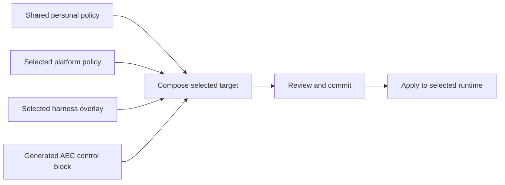

# Shared instructions — 2.0 development direction

Status: approved direction; implementation remains incremental on
`development/2.0`.

AEC will reuse personal instructions across enrolled local harnesses. Git history
remains the source of truth. Equivalent instructions do not guarantee identical
model behaviour.



## Ownership and sources

| Source | Contents | Owner |
|---|---|---|
| `environment/shared/instructions.md` | Collaboration, approval, engineering, learning, documentation, agile and architecture preferences; general parallel execution policy | User |
| `environment/platforms/<platform>/policy.md` | Explicitly approved local access roots and platform-specific personal rules | User |
| `environment/providers/<provider>/overlay.md` | Harness-specific execution preferences, including explicitly selected model mappings | User |
| AEC control block | Supported skill invocation, repository binding, canonical paths and directional command guidance | AEC |

Composition order is AEC block, shared instructions, selected platform policy,
then provider overlay. This is an assembly order, not permission for an overlay
to silently override shared approval or access restrictions.

For the current Codex instructions, move all personal sections into shared policy
except the folder-access rule and concrete subagent/model mechanics. Keep the
folder-access rule under user control in platform policy. Keep the current
Codex model mapping and worker mechanics in its overlay. Copilot initially needs
no invented execution mappings. Preserve unsupported or unclassified personal
text for review; never silently discard it.

## Lazy enrollment

First initialization on macOS ARM64 with Codex creates only these authored sources:

```text
environment/
├── shared/instructions.md
├── platforms/macos-arm64/policy.md
└── providers/codex/overlay.md
```

Existing canonical provider files, including Codex `AGENTS.md` and managed
`config.toml`, remain part of the migration scope. Explicitly initializing Copilot
adds its provider sources and output only. Initializing on another platform adds
that platform only. Do not scaffold unused platforms, unused providers, or empty
placeholder trees. Preserve previously enrolled data and manual ChatGPT backups.
CI coverage does not enroll a target in the user's repository.

## Direction and boundaries

- `status` inspects; `backup` captures runtime into the repository; `apply`
  deploys committed repository content. Preserve these separate directions.
- Shared-source changes should propagate through deterministic composition.
- Do not infer personal access permissions from installation paths.
- Do not treat provider directory presence as proof of local harness enrollment:
  a pulled repository can contain providers used only on another machine.
- Before runtime integration, resolve two open contracts: where committed
  platform-specific rendered outputs live, and how backup maps edits back to
  shared/platform/provider sources without overwriting newer shared policy.
- Platform policy is sufficient for the current single-machine case. Different
  machines on the same platform may need distinct access roots; defer their
  storage contract until required, rather than claiming platform equals machine.
- Keep CLI migration and multi-target `--all` semantics deferred until those
  contracts are reviewed. Previously illustrated command forms are proposals.

## Immediate increment: deterministic composition

Add a small .NET BCL composition function accepting explicitly supplied shared,
platform, provider and generated-block content. Produce a preview in memory;
perform no enrollment, runtime writes, commits or CLI migration in this increment.
Define separators and text preservation explicitly. Test stable output ordering,
empty optional content, line endings, and preservation of personal text with xUnit.
Use disposable fixtures rather than migrating the personal data repository.

The composition function uses two LF characters between nonempty sections,
independently of the operating system. All source characters, including trailing
newlines, CRLF, indentation and Unicode, remain unchanged. Empty sections are
omitted; whitespace-only content is retained. It adds no final newline. Optional
platform/provider text may be absent. The caller supplies the generated block;
this function neither validates that block nor interprets Markdown or resolves
policy conflicts. File encoding, source markers and safe reverse mapping remain
integration concerns for the next reviewed contract.

The user's pivotal review is the rendered Codex/Copilot pair: confirm that shared
approval and access policy are retained and provider-only instructions stay scoped.
Then choose the next small repository/enrollment increment from that evidence.
