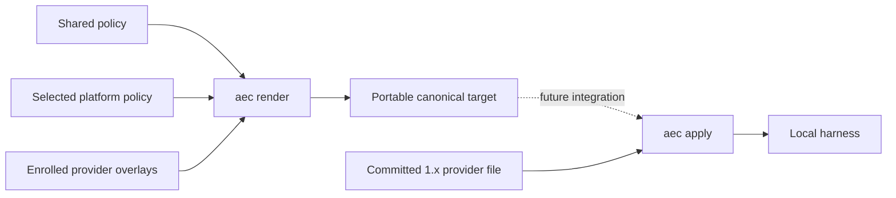
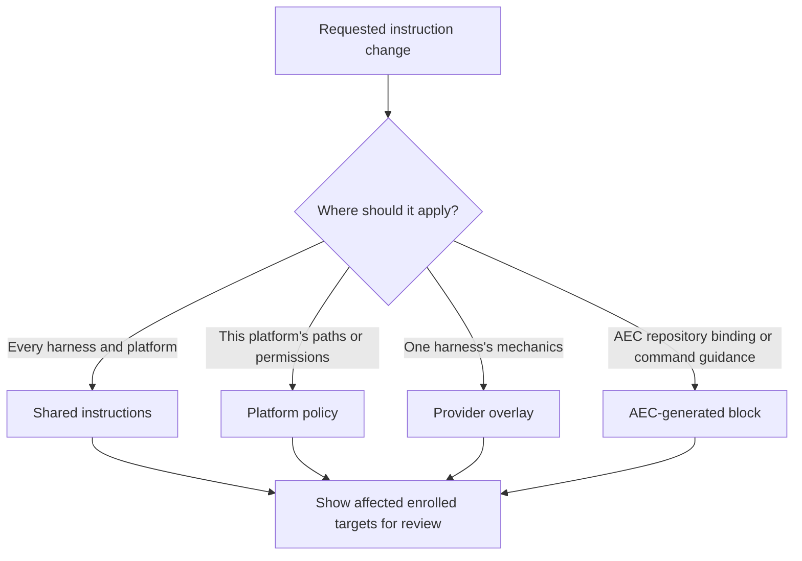
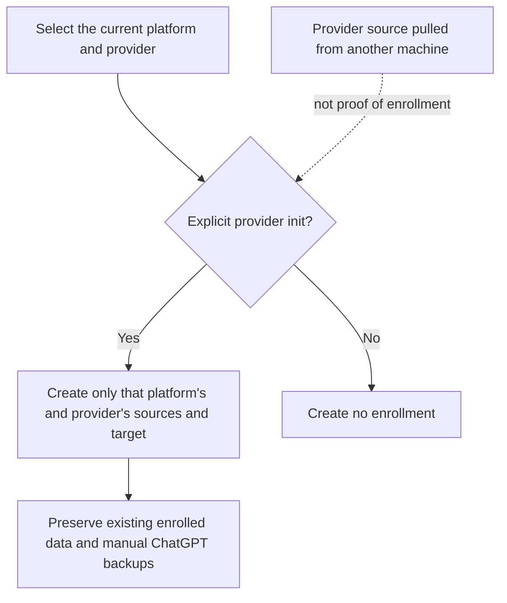
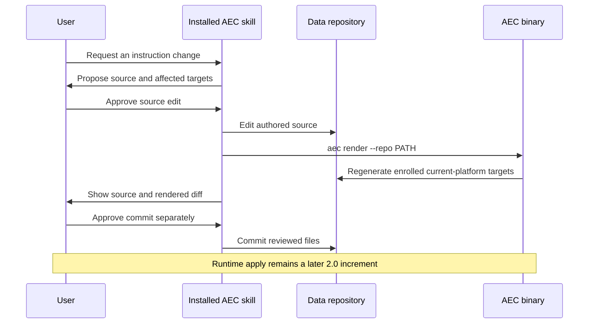
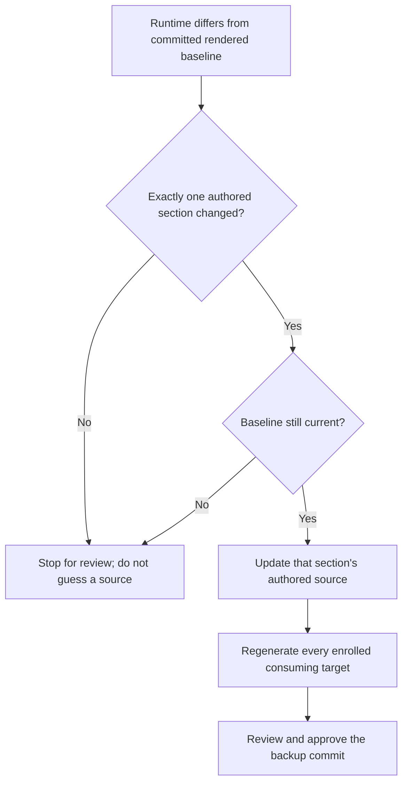

# Shared instructions — 2.0 development direction

Status: approved direction; implementation remains incremental on
`development/2.0`.



Git history remains the source of truth. Today, `render` only updates repository
targets; `apply` still reads the legacy provider file. Equivalent instructions
across harnesses do not guarantee identical model behaviour.

## Choose the authored source



| Source | Contents | Owner |
|---|---|---|
| `environment/shared/instructions.md` | Collaboration, approval, engineering, learning, documentation, agile and architecture preferences; general parallel execution policy | User |
| `environment/platforms/<platform>/policy.md` | Explicitly approved local access roots and platform-specific personal rules | User |
| `environment/providers/<provider>/overlay.md` | Harness-specific execution preferences, including explicitly selected model mappings | User |
| AEC control block | Supported skill invocation, repository binding, canonical paths and directional command guidance | AEC |

Composition order is AEC block → shared → platform → provider. Later sections
cannot silently override shared approval or access restrictions.

For current Codex content, shared policy owns general personal rules; platform
policy owns the approved folder-access rule; the Codex overlay owns model mapping
and worker mechanics. Do not invent Copilot mappings or discard unclassified text.

## Lazy enrollment



The intended first macOS ARM64 Codex initialization creates only:

```text
environment/
├── shared/instructions.md
├── platforms/macos-arm64/policy.md
└── providers/codex/overlay.md
```

Existing Codex `AGENTS.md` and managed `config.toml` remain migration inputs.
Initializing Copilot or another platform adds only the selected files. CI
coverage does not enroll anything in the user's data repository.

## Alignment workflow



Both installed skills use the same source decision; the binary validates and
renders it. `render` reports changed paths but never commits, applies, pushes,
or writes runtime. After future integration, an explicit `apply` will deploy
committed targets and `status` will compare them with runtime. There is no
automatic `sync`.

The v2 target path is
`environment/targets/<platform>/<provider>/<instruction-file>`. It contains
portable authored sections. AEC's machine-specific repository binding and
command guidance belong in a generated local runtime block, not the portable
target. Existing `environment/providers/<provider>/<instruction-file>` files
remain the active canonical paths until a reviewed migration.

Current `render` treats existing target directories as enrollment. Explicit
`init` enrollment and committed target-record validation are not implemented
yet; directory presence alone must not become the final trust rule.

Planned reverse mapping for `backup` is deliberately narrower than free-form
instruction editing:



Exact AEC-owned delimiters distinguish shared, platform and provider text.
Marker collisions, generated-block edits, outside text, multi-section changes,
and stale baselines stop. Safe reverse mapping is **not implemented yet**.

## Direction and boundaries

- `status` inspects; `backup` captures runtime into the repository; `apply`
  deploys committed repository content. Preserve these separate directions.
- Shared-source changes should propagate through deterministic composition.
- Do not infer personal access permissions from installation paths.
- Do not treat provider directory presence as final proof of local harness
  enrollment: a pulled repository can contain providers used only elsewhere.
- Before runtime integration, implement the target-record and committed-baseline
  checks described above. The current CLI does not yet support them.
- Platform policy is sufficient for the current single-machine case. Different
  machines on the same platform may need distinct access roots; defer their
  storage contract until required, rather than claiming platform equals machine.
- Keep CLI migration and multi-target `--all` semantics deferred until those
  contracts are reviewed. Previously illustrated command forms are proposals.

## Implemented foundation and next boundary


A small .NET BCL composition function accepts explicitly supplied shared,
platform, provider and generated-block content. Its preview is in memory and
does no enrollment, runtime write, commit or CLI migration. Focused xUnit tests
cover stable ordering, empty optional content, line endings and preservation of
personal text in disposable fixtures; the personal data repository is untouched.

The composition function uses two LF characters between nonempty sections,
independently of the operating system. All source characters, including trailing
newlines, CRLF, indentation and Unicode, remain unchanged. Empty sections are
omitted; whitespace-only content is retained. It adds no final newline. Optional
platform/provider text may be absent. The caller supplies the generated block;
this function neither validates that block nor interprets Markdown or resolves
policy conflicts. The repository-only render command now wraps authored sections
with exact markers and validates strict UTF-8. Runtime integration and safe
reverse mapping through `backup` remain separate increments.

The approved rendered Codex/Copilot example confirms that shared approval and
access policy are retained while provider-only instructions stay scoped. The
next increment is explicit current-platform/provider enrollment; until then,
the existing provider-specific canonical files remain the deployment source.
